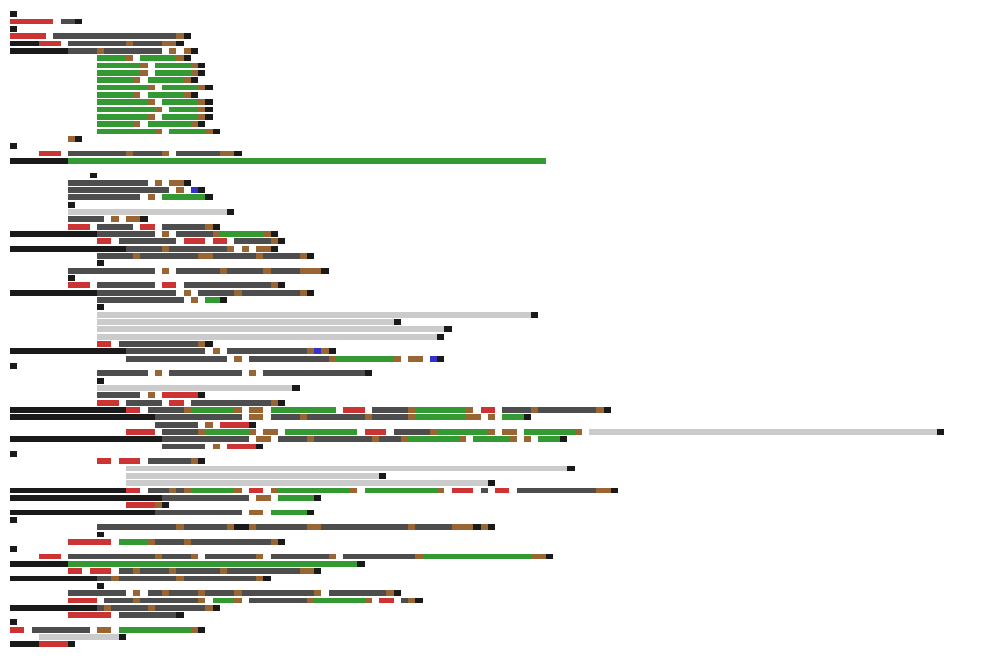

# Code-as-Art Generator

**Turn your Python code into abstract art.**


## Why Code-as-Art?

Code is structure. It has rhythm, indentation, and flow. Usually, we read it for logic, but what if we looked at it for **aesthetics**?

This project explores the visual nature of programming. By stripping away the syntax and leaving only the structure—keywords behavior as colors, nesting as shapes—we reveal the hidden beauty of our algorithms.

Whether you want to visualize the complexity of a sorting algorithm or just create a cool wallpaper from your latest script, **Code-as-Art Generator** is for you.

## Features

- **🎨 Visual Art**: Generates colorful, abstract block diagrams using Matplotlib.
- **📝 ASCII Art**: Creates text-based structural diagrams.
- **📜 Code Poetry**: Extracts strings and comments to form "accidental poetry."
- **💻 CLI Tool**: Unified command-line interface for all generators.
- **🌐 Web App**: Drag-and-drop web interface for easy generation.
- **🤖 Automation**: GitHub Action automatically updates a gallery of your repo's art.

## Getting Started

### Installation

1.  Clone the repository:
    ```bash
    git clone https://github.com/BradRobin/Code-as-art-generator.git
    cd Code-as-art-generator
    ```
2.  Install dependencies:
    ```bash
    pip install -r requirements.txt
    ```

### CLI Usage (`codeart`)

The `codeart.py` script is your main entry point.

**Generate Visual Art (PNG):**
```bash
python codeart.py myscript.py --graphics -o art.png
```

**Generate ASCII Art (Text):**
```bash
python codeart.py myscript.py --ascii
```

**Generate Code Poetry:**
```bash
python codeart.py myscript.py --poetry
```

### Python API Usage

You can use the generators directly in your own scripts.

```python
from src.parser import PythonCodeParser
from src.visual_generator import VisualArtGenerator

# 1. Parse Code
code = "..."
parser = PythonCodeParser()
tokens = parser.parse(code)

# 2. Generate Art
viz = VisualArtGenerator()
viz.generate(tokens, "output.png")
```

### Web Application

Prefer a UI? Run the included Flask app:

```bash
python app.py
```
Open `http://localhost:5000` to upload files and see results instantly.

## Gallery

Check out the `gallery/` folder for auto-generated examples from this repository!

| Visual Art | ASCII Art |
|------------|-----------|
|  | [ascii_generator.txt](gallery/ascii/ascii_generator.txt) |

## Developer Setup

See [docs/SETUP.md](docs/SETUP.md) for detailed instructions on contributing and running tests.

## License

MIT
